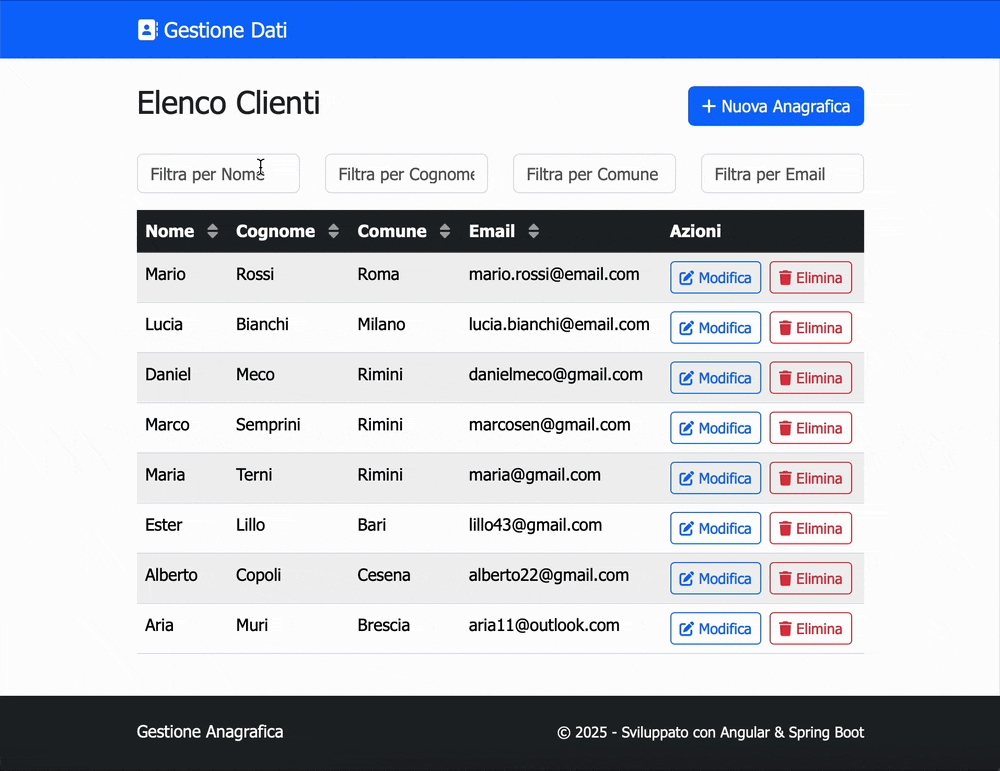
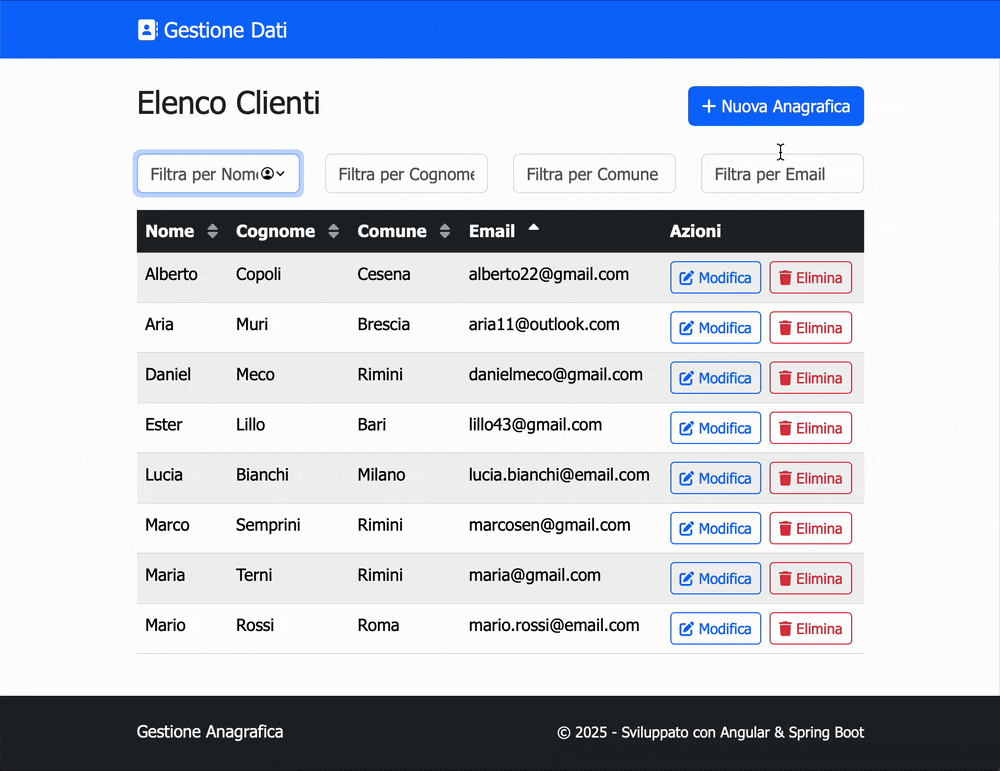
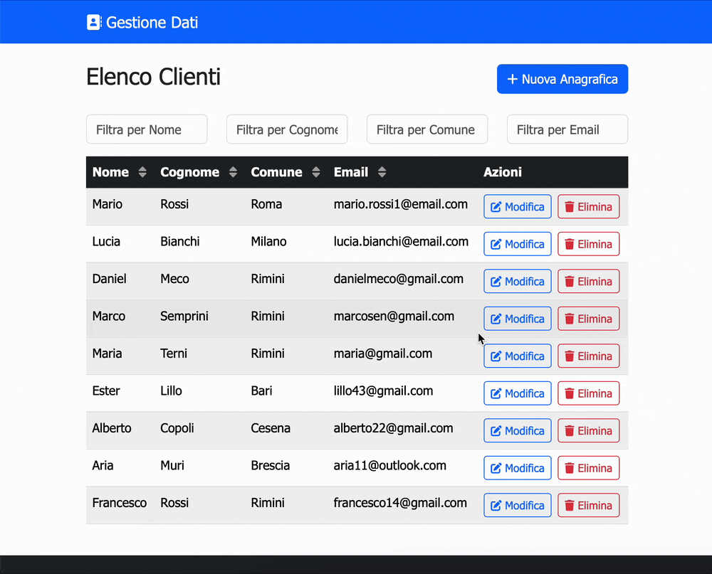

# AnagraficaClient

This project was generated using [Angular CLI](https://github.com/angular/angular-cli) version 19.2.15.

## Features Demo

### Client List and Filters
  

### Create New Client
  

### Edit Client
  

### Delete Client
  

## Development server

To start a local development server, run:

```bash
ng serve
```

Once the server is running, open your browser and navigate to `http://localhost:4200/`. The application will automatically reload whenever you modify any of the source files.

## Code scaffolding

Angular CLI includes powerful code scaffolding tools. To generate a new component, run:

```bash
ng generate component component-name
```

